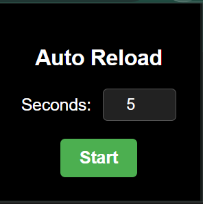
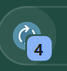
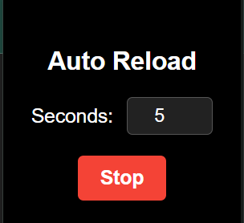

# Auto Reload Chrome Extension

A minimalistic Chrome extension that automatically reloads the active tab at user-defined intervals. The extension includes a simple interface, live countdown on the pinned icon, and the ability to start and stop the reload process.

---

## Features

- **Custom Reload Timer**: Set the reload interval in seconds (minimum of 5 seconds).
- **Live Countdown on Icon**: Displays the remaining time on the extension's pinned icon.
- **Start and Stop Functionality**: Toggle between starting and stopping the reload process with a single button.
- **Minimalistic Design**: A sleek, black-themed interface for ease of use.
- **Persistent Updates**: Real-time updates to the countdown and reload process.

---

## How to Use

1. **Install the Extension**:

   - Clone or download the repository.
   - Open Chrome and navigate to `chrome://extensions/`.
   - Enable **Developer Mode** (toggle in the top-right corner).
   - Click **Load unpacked** and select the project folder.

2. **Set Reload Interval**:

   - Click the extension icon in the Chrome toolbar.
   - Enter the desired reload interval (in seconds) into the input field. Minimum value is 5 seconds.

3. **Start Reloading**:

   - Click the **Start** button to begin reloading the active tab at the specified interval.
   - The countdown will display on the extension's icon.

4. **Stop Reloading**:
   - Click the **Stop** button to halt the reload process and clear the countdown.

---

## Screenshots

### Start Screen

### Active Timer

### Stop Screen

---

## Contributing

Feel free to contribute to this project by:

- Reporting bugs.
- Suggesting new features.
- Submitting pull requests.

---

## License

This project is licensed under the [MIT License](LICENSE).
